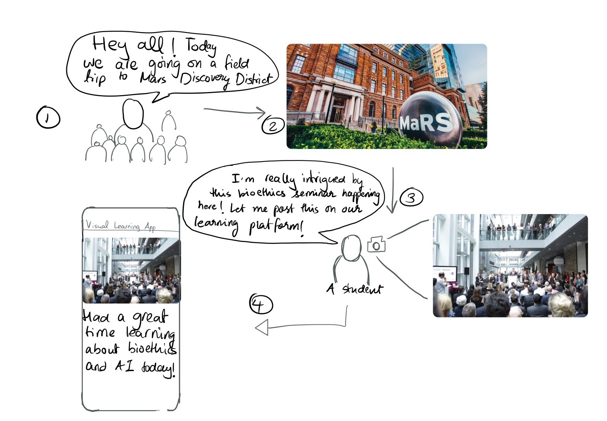

# Overview
> This is an application that facilitates the sharing of experiential learning at Kingsway College School.

In education, the final result of a student’s work is visible, but the process to get there is usually invisible. We want to make this process visible so that students can benefit from understanding how other students learn and reach solutions. This is backed by research from Harvard and part of the principles that Kingsway practices in its approach to education. The users of this platform will be primarily students and teachers can play an administrative and a content-inspiring role. After a discussion with the Head of Senior School at Kingsway College School (KCS), we came up with several common use cases:

Imagine that grade 9 students are given this formative assignment: Find 5 places in Toronto and write down what learning value can be obtained by engaging with the particular location.

For the example above, students don’t have an easy way to capture and share their experiential learning with their schoolmates. Although mainstream social media tools exist, they are unsuited for the unique needs of KCS and come with major drawbacks that include distraction away from learning as well as unhealthy issues that arise from misuse of social media. The proposed app is clean, simple, and focused solely on making learning visible.

We have built both a mobile application and a web application to facilitate this sharing of experiential learning. The workflow below describes how an experiential learning platform at field trips, which are common at Kingsway College School.

# Web Appplication
Screenshots here!
Little summary, 
link to folder and direction to read readme

# Mobile Application
The Mobile application is going to be the key platform where students will be able to share and view others' experiential learning. Check it out in the frontend-mobile folder of this repository!

# Team
> Read more about how we organized our team in our initial [planning document](deliverables/deliverable-1/planning.md)

### Ryan Marten
_Project Manager + Web Feature Lead_

### Nick Perrin
_Team Lead + Mobile Feature Lead_

### Marco Angeli 
_Mobile Application Lead_

### Joshua Bragg
_Web Application Lead_

### Devin Castaban
_Backend AWS Lead_

### Alex Cann
_Backend Feature Lead_

### Shardul Bansal
_Mobile Feature Lead_

